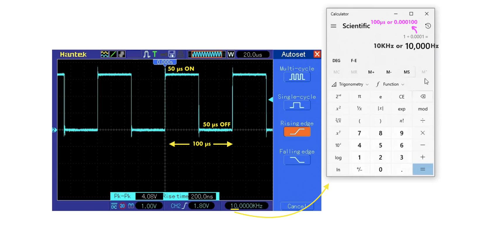

ESP Timer [API reference](https://docs.espressif.com/projects/esp-idf/en/latest/esp32/api-reference/system/esp_timer.html)      
     
**Timeout Value Limits**      
As callback dispatching can never be instantaneous, the one-shot and periodic timers created with ESP Timer also have timeout value limits. These limits cannot be estimated precisely, because they depend on multiple factors.     
       
For reference, the ESP32 running at 240 MHz and using the Task Dispatch method has the approximate minimum timeout values as follows:     
      
- One-shot timers: ~20 us      
If esp_timer_start_once() is called, this is the earliest time after which the system will be able to dispatch a callback.     
      
- Periodic timers: ~50 us      
Periodic software timers with a smaller timeout value would simply consume most of the CPU time, which is impractical.      
      
The lower the CPU frequency, the higher the minimum timeout values will be. The general guideline is if the required timeout values are in the order of tens of microseconds, the user application needs to undergo thorough testing to ensure stable operation.      
        
If the minimum timeout values slightly exceed the requirements, the Interrupt Dispatch method might offer an improvement.       
       
For even smaller timeout values, for example, to generate or receive waveforms or do bit banging, the resolution of ESP Timer may be insufficient. In this case, it is recommended to use dedicated peripherals, such as GPTimer or RMT, and their DMA features if available.       
      
    