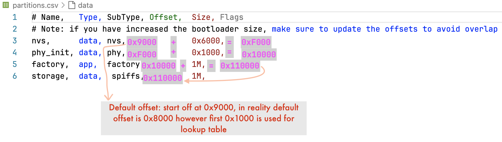

One of the benefit of SPIFFS is that you can upload different files or change the files without affecting the application or program that is running on chip.   
For instance we want to change/update `index.html` (update some fields) or we have configuration file that differes for bunch of different chips.   
Let's say inserting `<h1>Hello world!</h1>` inside `<body>` without having to do this at flash time, but arbitraily at some other point in time. To do this, we need two script files `esp/esp-idf/components/spiffs/spiffsgen.py` and `esp/esp-idf/components/esptool_py/esptool/esptool.py`     
    
## spiffsgen.py   
Give us the capability of taking a folder and producing a .bin file out of that particular directory. `spiffsgen.py` takes 3 arguments, one of them is **image_size** which is _1M_ for _storage_ in our `partitions.csv`. **base_dir** is our `spiffs_dir` and finally **output_file** which is desired name of .bin file.   

**Generate bin file**       
     
Run the following command    
```bash
~/esp/esp-idf/components/spiffs/spiffsgen.py 0x100000 spiffs_dir spiffs_dir.bin
```      
   
Generated file `spiffs_dir.bin` will be exactly 1MB. That is designed to fill up the entire partition

## esptool.py   
Uses .bin file generated from `spiffsgen.py` and dumping it into the partition in flash. You may have to issue `chmod +x ~/esp/esp-idf/components/esptool_py/esptool/esptool.py` if you get permission denied error (running `ls -la` gave you `-rw-r--r--`). If you still encounter an error then use `python ~/esp/esp-idf/components/esptool_py/esptool/esptool.py -h` and you see `-h` gives you quite a few parameters as this tool is not only used for flashing SPIFFS but also other sort of flashing.    

**Flash bin file**    
     
Following is the general layout with arguments.     
`python esptool.py --chip esp32 --port <port> --baud 115200 write_flash -z <start address> <the bin file>`           
    
Let's run this command as follows    
```bash
python ~/esp/esp-idf/components/esptool_py/esptool/esptool.py --chip esp32 --port /dev/tty.usbserial-0001 --baud 115200 write_flash -z 0x110000 spiffs_dir.bin
```         
    
That's how we updated the SPIFFS on our chip without changing our application.     
     
Now only run `idf.py monitor` without `flash` command. You will see the _html_ will be updated with `<h1>Hello world!</h1>` inside `<body>`    
     
**How to calculate the start address**     
     
        
