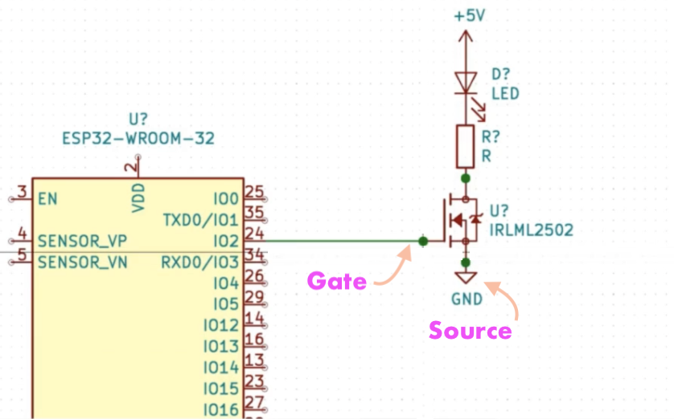

Some of the consideration to take when using ESP32.     
    
Do not exceed 20 milliamps per pin    

Do not exceed 40 milliamps in total on all the pins .     

 Voltage on pins in our device is 3.3v. If voltage drop across the diod 2.75 (inspect with _Transistor Tester_ device). 3.3 - 2.75 = **0.55v** total voltage exist between 3.3v pin and GND when diod in place.     

**V = I x R**  OR  **R = V / I**  becomes **R = 0.55 / 0.02** (0.02 amps or 20 milliamps) **27.5 OHMS**     

If you want to drive 2 that will be 40 milliamps and will be fine. However to drive 3 or 4 leds or motor that requires an amp. To fix this particular situation, we use **FET** (Field Effect Transistor).    

What FET you can use to drive 20 milliamps or higher load really depnds on voltage. However a good starting point is to look at the datasheet to ensure that voltage between the gate and the source threshold is below 3.3v (as shown below). If it's not that then it won't ever switch on as we can only get 3.3v out of these pins   
    
     
     
IRLML2502 is good FET and you need a tiny breakout board to put it on your breadboard.    

### Connection details  

| ESP32 | IRLML2502 | LED |      
|:--------|:--------|:--------|
| 26   | 1st pin  |    |   
| GND   | GND (3rd pin)  | GND   |   
|    | Mid-pin  | Other end   |  
    
               