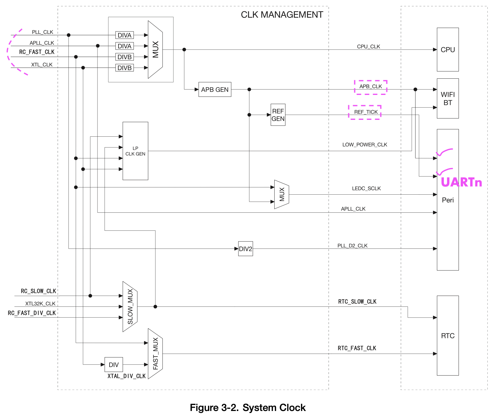
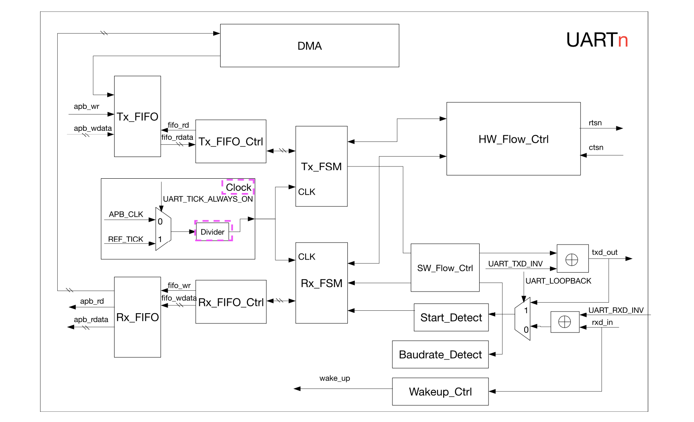

Embedded applications often require a simple method of exchanging data between devices that need minimal system resources. The _Universal Asynchronous Receiver/Transmitter (UART)_ is one such standard that can offer a flexible full-duplex data exchange among different devices.    
    
The **three** UART controllers (UART0, UART1, and UART2) available on a chip are compatible with UART-enabled devices from various manufacturers.   

The _Asynchronous mode_ of transmission means it is not necessary to add clocking information to the data being sent (as in case of SPI and I2C etc). This, in turn, requires that the data rate, STOP bits, parity, etc., be identical at the transmitting and receiving end for the devices to communicate successfully.      

### UART Frame structure    

 A typical UART frame begins with a START bit, followed by a “character” and an optional parity bit for error detection, and it ends with a STOP condition. 

### UART Clock source and block diagram    

To create a desired baudrate, it can derive its clock from two sources `APB_CLK` at 80MHz or the reference clock `REF_TICK`. These two clock are sourced either by: (as shown in _Figure 3-2 System clock_ at page 40)    
- **PLL_CLK** is internal PLL clock with a frequency of 320MHz or 480MHz  
- **APLL_CLK** is internal Audio PLL clock with frequency range of 16 ~ 128MHz
- **RC_FAST_CLK** is an internal low power clock default to 8MHz and frequency is adjustable.  
- or **XTL_CLK (High speed clock)**, clock signal generated using an _external crystal_ with a frequency range of 2 ~ 40 MHz       

    

> [!NOTE]    
> Almost all the peripherals (like I2C, SPI, I2S, SDIO Slave, SDMMC, eFuse Controller and EMAC etc) take its clock source from `APB_CLK` except UART and RMT which also can take from `REF_TICK`, whereas `LED_PWM` can be sourced from `APB_CLK`, `REF_TICK` and `LEDC_SCLK`.    
> These 2 clocks for UART can be configured through `UART_TICK_REF_ALWAYS_ON`  

     

The **Divider** further slows down the selected clock source (`APB_CLK` or `REF_TICK`) to generate clock signals to drive the UART module (Both Tx_FSM and Rx_FSM, Finite state machine to send/receive data). Divider can be configured through `UART_CLKDIV_REG` which contains `UART_CLKDIV`(integral part) and `UART_CLKDIV_FRAG`(decimal or mantissa fractional part)     

### Tx and Rx       

UART controller can be broken down into two functional blocks will give you **Tx** (transmission block) and **Rx** (Reception block). Both blocks have respected buffer of their own namely _Rx_FIFO_ and _Tx_FIFO_.    
    
Software can write into **Tx_FIFO** buffer (for transmission) or read **Rx_FIFO** through APB or either by DMA And **Tx_FIFO_Ctrl** is used to control read (to check if Tx_FIFO is not full) and write (to transmit data into outside world) access to this buffer whereas actual read/write takes place by **Tx_FSM**    

You can also see the UART block diagram above that during TXing (transmission) `txd_out` it also listens back via Rx through `UART_LOOPBACK` functionality by configuring the `UART_TXD_INV`. There's also `UART_RXD_INV` register to control the negation of input stream `rxd_in`.    

Furthermore, in the case `rxd_in` (in reception) **Baudrate_Detect** name implies measures the _Baudrate_ or in other words minimum pulse width of an input stream `rxd_in`. Similarly **Start_Detect** sit their to watch for the _Start bit_ in a frame of incoming data `rxd_in`. Once _Start bit_ detects then **Rx_FSM** stores the incoming data from the received frame into `Rx_FIFO` buffer by checking the access control via `Rx_FIFO_Ctrl`    

**Wakeup_Ctrl** continuously filter out (counting pulses) the `rxd_in` line when UART is in Light-sleep mode. When the number/positive edges of RxD signal is greater than or equal to (UART_ACTIVE_THRESHOLD+2), a wake_up signal will be generated and sent to RTC and RTC will then wake up the UART controller.      

> [!NOTE]    
> Only **UART1** and **UART2** peripheral support Ligh-speed mode and `rxd_in` reception cannot come via GPIO Matrix but only through IO_MUX.                 
     
### UART RAM      

Three UART controller shares 8bit RAM[1024] space (1024 x 8-bit). In other word increment 128 bytes offset for each buffer Rx/Tx buffer of UARTn.         

| Offset |  Peri-Buffer  |                
|:-----------|:-----------|     
| 0 - 128 | UART0 Tx_FIFO |     
| 128 - 256 | UART1 Tx_FIFO |    
| 256 - 384 | UART2 Tx_FIFO |     
| 384 - 512 |  |    
| 512 - 640 | UART0 Rx_FIFO |       
| 640 - 768 | UART1 Rx_FIFO |     
| 768 - 896 | UART2 Rx_FIFO |    
| 896 - 1024 |  |    

### UART Features          
    
- Programmable baud rate
- 1024 × 8-bit RAM shared by three UART transmit-FIFOs and receive-FIFOs • Supports input baud rate self-check
- Supports 5/6/7/8 bits of data length
- Supports 1/1.5/2/3 STOP bits
- Supports parity bit
- Supports RS485 Protocol
- Supports IrDA Protocol (Infrared Data Exchange)
- Supports DMA to communicate data in high speed
- Supports UART wake-up
- Supports both software and hardware flow control       
     
### UART peripherals    
| UART Port | Rx | Tx | Useable |
|:------------|:------------||:------------|:-----------------------------|
| UART0 | GPIO3 | GPIO1 |    |       
**| UART1 | GPIO5 | GPIO4 |    |**    
| UART2 | GPIO16 | GPIO17 |    |
      
### Application Instruction     

Take one wire and short GPIO5 and GPIO4 on ESP32_DevKitC_v4 (WROOM or WROVER)          
