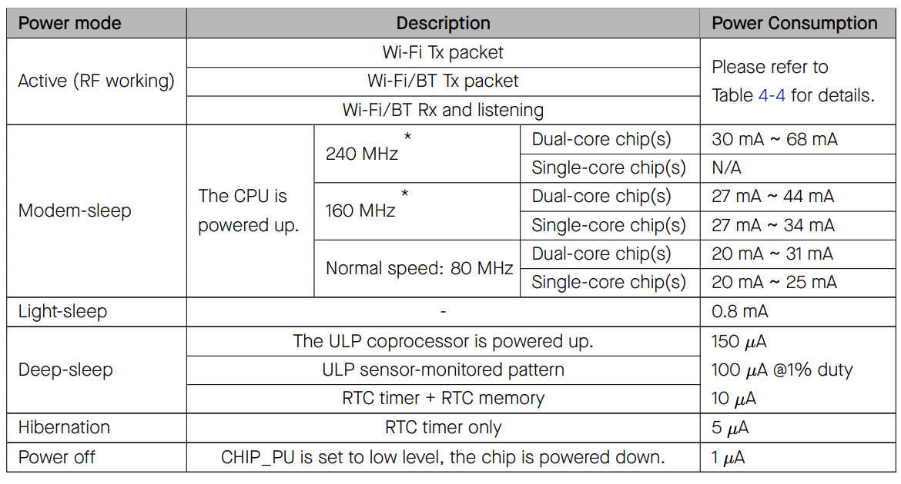

| Full power | Light sleep | Deep sleep |    
|:--------------|:--------------|:--------------|      
| $${\color{Blue}Peripherals}$$ | $${\color{darkgray}Peripherals}$$ | $${\color{darkgray}Peripherals}$$ |     
| $${\color{Blue}Bluetooth}$$ | $${\color{gray}Bluetooth}$$ | $${\color{darkgray}Bluetooth}$$ |     
| $${\color{Blue}WiFi}$$ | $${\color{gray}WiFi}$$ | $${\color{darkgray}WiFi}$$ |    
| $${\color{Blue}Cores}$$ | $${\color{Blue}Cores}$$ | $${\color{darkgray}Cores}$$ |     
| $${\color{Blue}Coprocessor}$$ | $${\color{Blue}Coprocessor}$$ | $${\color{SkyBlue}Coprocessor}$$ |     
| $${\color{Blue}RTC}$$ | $${\color{Blue}RTC}$$ | $${\color{Blue}RTC}$$ |            

### Power Consumption by Power Modes     
     

[Table 3-2, datasheet page: 70](https://www.espressif.com/sites/default/files/documentation/esp32_datasheet_en.pdf)              
      
### Wake up modes     
| Light sleep | Deep sleep |   
|:------------------|:------------------|        
| Timer | Timer |    
| Touch pad | Touch pad |   
| External wakeup | External wakeup |    
| (ULP Coprocessor ADC) | $${\color{darkgray}(ULP Coprocessor ADC)}$$ |    
| (ULP Corprocessor I2C) | $${\color{darkgray}(ULP Corprocessor I2C)}$$ |    
| GPIO wakeup |  |     
| UART wakeup |  |       
    
You can read the [details](https://docs.espressif.com/projects/esp-idf/en/latest/esp32/api-reference/system/sleep_modes.html#overview) on wake up modes.     
     
This program in `main.c` demonstrated light sleep by providing duration.     

> [!IMPORTANT]      
> Running the program will halt and output both printf statements later. However we supposed to get first printf statement before sleep, in reality, we didn't get any. To fix this we use `uart_tx_wait_idle(CONFIG_ESP_CONSOLE_UART_NUM)`         
    

