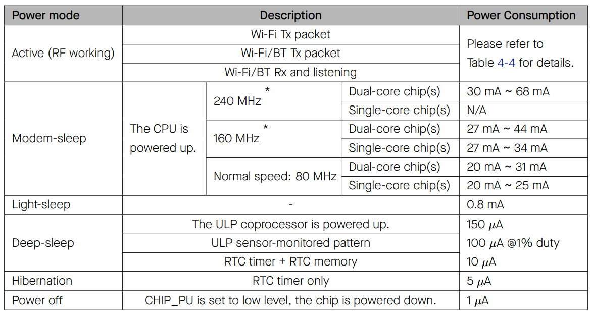

EXT1 is useful as it has few other options than EXT0. Another difference is EXT0 actually turns on every rtc peripheral, on the other hand, EXT1 doesn't (enable with `esp_sleep_pd_config()`).     
    
`esp_sleep_pd_config()` its takes two parameters `domain` and `option`. domain has following structure:   
```c
typedef enum {
#if SOC_PM_SUPPORT_RTC_PERIPH_PD
    ESP_PD_DOMAIN_RTC_PERIPH,      //!< RTC IO, sensors and ULP co-processor
#endif
#if SOC_PM_SUPPORT_RTC_SLOW_MEM_PD
    ESP_PD_DOMAIN_RTC_SLOW_MEM,    //!< RTC slow memory
#endif
#if SOC_PM_SUPPORT_RTC_FAST_MEM_PD
    ESP_PD_DOMAIN_RTC_FAST_MEM,    //!< RTC fast memory
#endif
    ESP_PD_DOMAIN_XTAL,            //!< XTAL oscillator
#if SOC_PM_SUPPORT_XTAL32K_PD
    ESP_PD_DOMAIN_XTAL32K,         //!< External 32 kHz XTAL oscillator
#endif
#if SOC_PM_SUPPORT_RC32K_PD
    ESP_PD_DOMAIN_RC32K,           //!< Internal 32 kHz RC oscillator
#endif
#if SOC_PM_SUPPORT_RC_FAST_PD
    ESP_PD_DOMAIN_RC_FAST,         //!< Internal Fast oscillator
#endif
#if SOC_PM_SUPPORT_CPU_PD
    ESP_PD_DOMAIN_CPU,             //!< CPU core
#endif
#if SOC_PM_SUPPORT_VDDSDIO_PD
    ESP_PD_DOMAIN_VDDSDIO,         //!< VDD_SDIO
#endif
#if SOC_PM_SUPPORT_MODEM_PD
    ESP_PD_DOMAIN_MODEM,           //!< MODEM, includes WiFi, Bluetooth and IEEE802.15.4
#endif
#if SOC_PM_SUPPORT_TOP_PD
    ESP_PD_DOMAIN_TOP,             //!< SoC TOP
#endif
    ESP_PD_DOMAIN_MAX              //!< Number of domains
```      
    
We previously saw following _Table 6_ where we could keep the chip in deep sleep or actually take it down to even hibernation mode by turning various thing on or off.     
     


In this particula case when we use EXT1, the `ESP_PD_DOMAIN_RTC_PERIPH` is turned off so we need to switch it back on.            
     
In `esp_sleep_enable_ext1_wakeup(mask, mode)` we can put multiple pins with `mask`, `mode` can be wakeup all low or high. Means we can put multiple buttons into our circuit and we can expect all of them to go low before chip wakes up or we can configure it to go high when chip wakes up.    
     
When both push buttons are pressed (GNDed) then chip will wakeup.    

| ESP32 | Push Button 1 | Push Button 2 |     
|:--------|:--------|:--------|    
| 25 | one side | |   
| 26 | | one side |    
| GND | other end | other end |    
