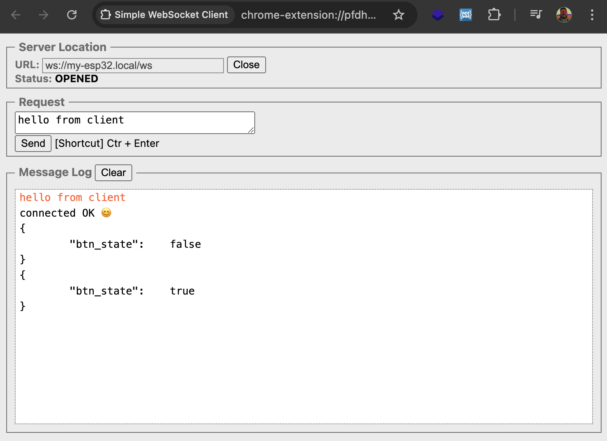

Turn on the websocket support by going to menuconfig `idf.py menuconfig` and select `WebSocket server support`:    
`Component config > HTTP Server > WebSocket server support`    
     
> [!NOTE]      
> In real world application where you would have multiple clients you may want to make `client_session_id` an array or linked list.     
     
- To actually hit the WebSocket endpoint we will need a different client, one of the choice is [Simple Websocket client](https://chromewebstore.google.com/detail/simple-websocket-client/pfdhoblngboilpfeibdedpjgfnlcodoo) at Chrome webstore.     
- Install it as Chrome extension and type in URL `ws://my-esp32.local/ws` and hit _Open_. You will encounter an error **W (81699) httpd_txrx: httpd_resp_send_err: 431 Request Header Fields Too Large - Header fields are too long**. In other words, our WebSocket client is actually giving us way too much information and our ESP32 doesn't have enough memory allocated to handle these headers.     
- To fix this go to _menuconfig_ and change the `Component config > HTTP Server > Max HTTP Request Header Length` to _1024_     
- Go back to _Simple Websocket client_ type in URL `ws://my-esp32.local/ws`, hit _Open_ and type in `hello from client` in the _Request_ box and hit _Send_.     
- Finally press pushbutton of ESP32.       
     
     