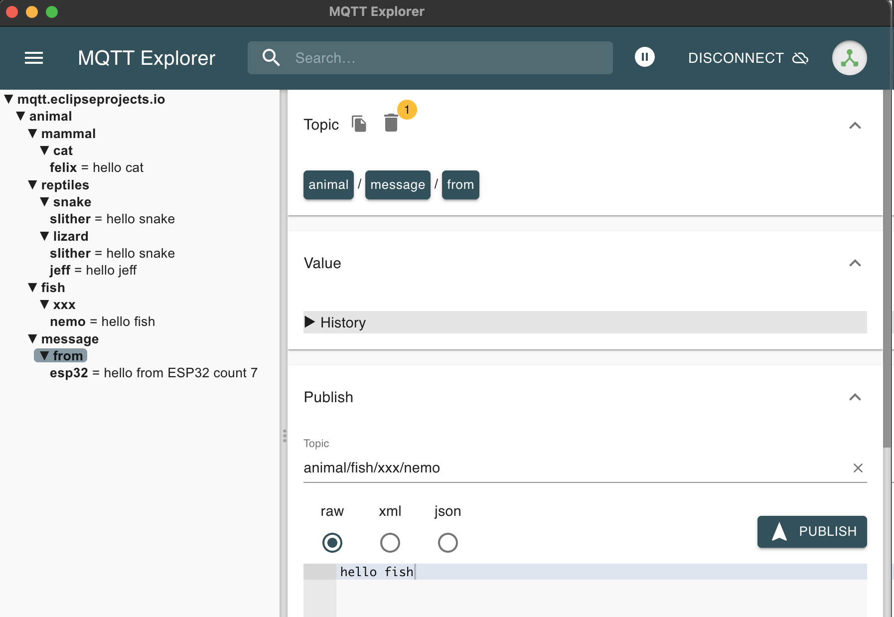

### Topics    
- Topics are hierarchical General/less-general/more-specific    
    
i.e.     
- house1/room1/temperature     
- house2/room3/humidity     

- Topics can have wildcards, **+** Replaces one segment in a topic i.e. `house1/+/temperature`. whereas **#** replaces the rest of the topic i.e. `house1/#`      

### QOS (Quality of service)       
- QoS 0; Esp32 send the message to broker i.e. fire and forget      
- QoS 1; Esp32 send the message to broker and gets Publish acknowledgment `PUBACK` message     
- QoS 2; Esp32 send the message to broker and gets Publish receive `PUBREC` message, and then send to the broker Publish released `PUBREL` message, finally broker send back Publish completion `PUBCOMP` message to Esp32.      

> [!NOTE]    
> Unless you have a good reason, use QoS 1    
      
          
          