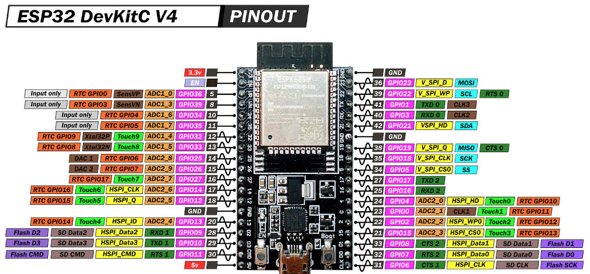

## ESP32 playground       
    
Board used is **ESP32 DevKitC V4**, this board only has one power LED and there's no User LED.	   
     
Board [Schematic](docs/esp32_devkitc_v4_schematic.pdf), [Datasheet](docs/esp32-wroom-32_datasheet_en.pdf), and [Reference Manual](docs/esp32_technical_reference_manual_en.pdf)	  
       
	   
## Pinout	   
     
 	 